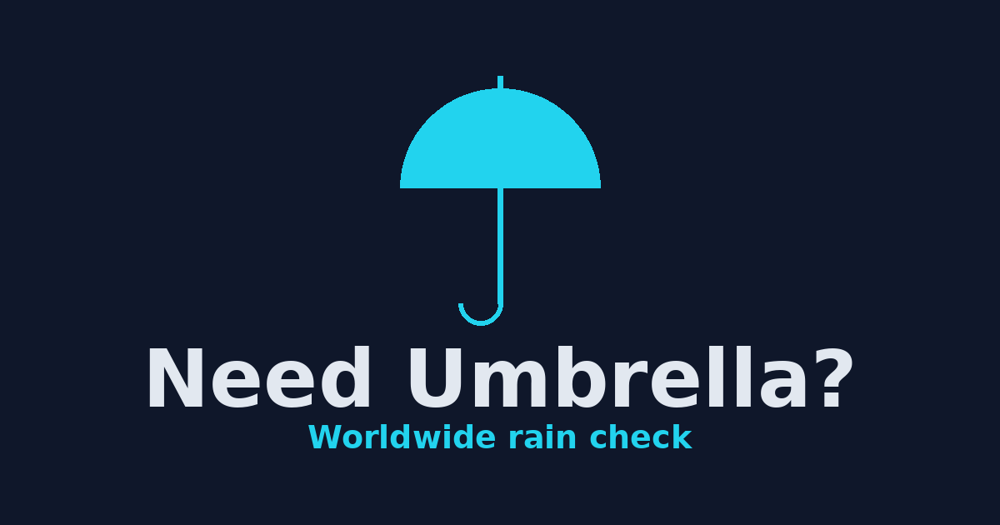

# Need Umbrella? ☔

[](https://github.com/zlatanstajic/need-umbrella/actions/workflows/deploy.yml)
[](LICENSE.md)
[](https://zlatanstajic.github.io/need-umbrella/)
[](https://www.typescriptlang.org/)
[](https://vitest.dev/)

> A single-page worldwide weather app with current conditions, a 24-hour rain
> outlook, an optional 7-day forecast, location comparison, and Serbian / English
> support — entirely client-side, with no backend.

☔ **Open the app:**
[zlatanstajic.github.io/need-umbrella](https://zlatanstajic.github.io/need-umbrella/)

Nothing to install. Add it to your phone's home screen (see
[Home screen install](#home-screen-install-ios--android)) to launch it
full-screen like a native app.



## Table of Contents

- [Features](#features)
  - [Current conditions and precipitation](#current-conditions-and-precipitation)
  - [Three ways to pick a location](#three-ways-to-pick-a-location)
  - [Saved locations](#saved-locations)
  - [Compare two cities](#compare-two-cities)
  - [7-day forecast](#7-day-forecast)
  - [Location time](#location-time)
  - [Settings](#settings)
  - [Home screen install (iOS / Android)](#home-screen-install-ios--android)
- [Building from source](#building-from-source)
- [Data and attribution](#data-and-attribution)
- [License](#license)

---

## Features

### Current conditions and precipitation

Current conditions (large temperature, weather emoji, description) plus detail
tiles for relative humidity, wind speed with 16-point compass direction, air
pressure, and cloud cover. After weather loads, the page title and header update
to reflect whether rain is expected. A 24-hour section sums hourly precipitation,
displays a rain / no-rain banner, and renders a scrollable hourly bar chart. Next
to the section heading, a bracketed summary shows when rain starts and stops plus
the total amount for that window — no scrolling needed for the overview.

### Three ways to pick a location

1. **GPS** — tap the GPS chip to use your device location via the browser
   geolocation API. On denial, error, or unavailability it falls back to
   Belgrade with a notice.
2. **City** — a dropdown of six preset cities (Belgrade, Novi Sad, Kragujevac,
   Nis, Pozarevac, Jagodina) with verified coordinates, offered as a
   convenience shortcut. Option labels follow the active language.
3. **Search** — type a place name and press Enter; results are fetched from the
   [Nominatim / OpenStreetMap](https://nominatim.openstreetmap.org/) geocoding
   API (up to 6 results) and displayed as clickable buttons.

The last-loaded location is remembered and restored on the next visit; Belgrade
is the fallback (and loads automatically on first visit).

### Saved locations

GPS and searched coordinates can be saved with a **Save location** button (on
the GPS and Search tabs). Saved entries appear as clickable chips in the GPS
tab — each loads instantly, can be renamed (✎) or removed (✕). A custom name,
when set, is shown verbatim and wins over reverse-geocoding; otherwise the chip
label is reverse-geocoded (and cached). The save button is disabled when the
current location is a preset city or already saved.

### Compare two cities

A **Compare** toggle in settings enables a side-by-side view of two locations.
The second slot has its own full set of GPS / City / Search inputs and its own
saved-location chips. The header rain indicator turns to "need umbrella" when
*either* location expects rain. The compare state (on/off plus the second
location) is remembered and restored on the next visit.

### 7-day forecast

A **7-day forecast** toggle in settings reveals a daily outlook (high/low
temperature, a weather emoji, and precipitation total per day) below the 24-hour
chart — it's additive, so the hourly view stays. The toggle state is remembered
across visits.

### Location time

Each weather card can show the selected location's current local time. The
clock is derived from the card's coordinates with `tz-lookup`, formatted by
the browser's `Intl` implementation as a 24-hour `HH:mm:ss` value, and refreshed
on second boundaries without fetching weather again. A localized date appears
only when the location's Gregorian calendar day differs from the browser's
local day. The setting applies to both comparison cards and is enabled by
default.

### Settings

A gear button (⚙️) fixed in the top-right corner opens a settings modal
containing:

- **Language** — switch between Serbian (Latin script) and English. The
  first-ever visit defaults to Serbian; the choice is remembered and restored on
  later visits. Switching re-fetches the current location so all dynamic text
  reloads in the new language.
- **Show location selector** — a toggle to hide or reveal the entire location
  selector panel.
- **Compare** — a toggle that enables the two-location comparison view (see
  above).
- **7-day forecast** — a toggle that shows or hides the daily outlook (see
  above).
- **Location time** — a toggle that immediately shows or hides the live local
  clock on every displayed weather card. The preference is remembered.
- **Data** — **Export** downloads all your saved settings (language, saved
  locations, compare/forecast preferences, and location-time preference) as a
  `nu-data.json` file;
  **Import** reads such a file back to restore that state — useful for backup or
  moving to another browser or device. Importing replaces your current data and
  reloads the app; an invalid file is rejected and leaves your data untouched.

All settings and saved data are stored locally in your browser (in
`localStorage`); nothing is sent to a server.

### Home screen install (iOS / Android)

The app can be saved to the home screen for an app-like experience:

- **iOS (Safari):** Share → Add to Home Screen. Launches full-screen without
  browser chrome, using `assets/img/apple-touch-icon.png` (180×180) as the icon.
- **Android (Chrome):** Menu → Add to Home Screen, or accept the install
  prompt. Uses the `theme-color` meta tag to tint the system UI.

[⬆ back to top](#table-of-contents)

---

## Building from source

The app is written in TypeScript under `src/` and bundled by
[esbuild](https://esbuild.github.io/) into `assets/js/app.js`. To build it
yourself:

```bash
npm install          # installs the toolchain and coordinate time-zone data
npm run typecheck    # type-check with tsc (strict)
npm run build        # bundle src/ -> assets/js/app.js
python3 -m http.server 7000   # then open http://localhost:7000
```

`assets/js/app.js` is a generated artifact (committed so the site runs from a
plain checkout) — edit `src/`, not the bundle. Pushing to `master` builds and
deploys to GitHub Pages via GitHub Actions.

The social-preview image (`assets/img/og-image.png`, 1200×630, used for link
previews on social platforms) is generated by a committed Pillow script and can
be regenerated with:

```bash
python3 scripts/gen-og-image.py   # requires Pillow (pip install Pillow)
```

The output is deterministic — re-running reproduces the same PNG.

[⬆ back to top](#table-of-contents)

---

## Data and attribution

Weather data from [MET Norway](https://www.met.no/) via the Locationforecast
2.0 compact API, licensed under
[CC BY 4.0](https://creativecommons.org/licenses/by/4.0/).

[⬆ back to top](#table-of-contents)

---

## License

MIT — see [LICENSE](LICENSE.md).

[⬆ back to top](#table-of-contents)
